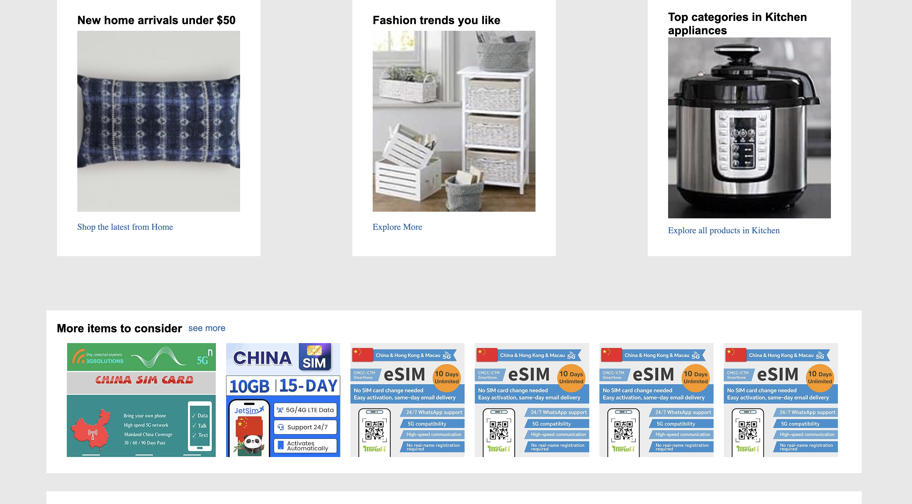
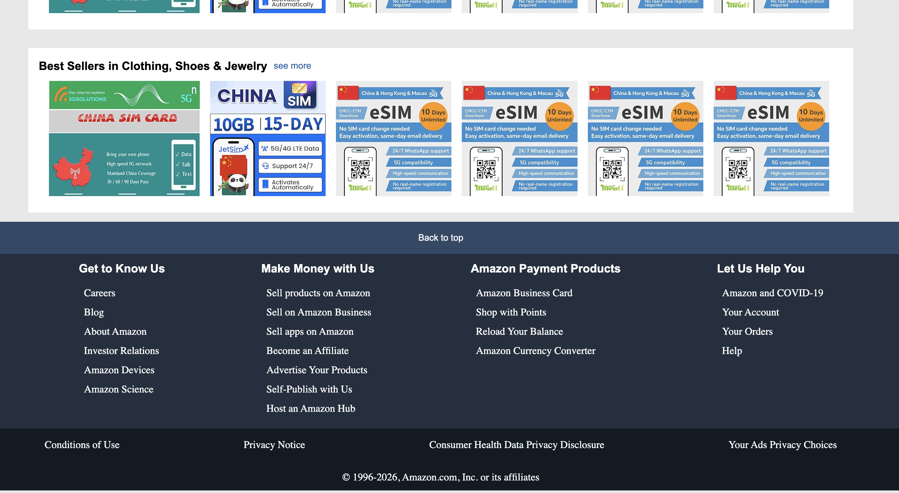

# Amazon-home-clone
Amazon homepage clone built using pure HTML and CSS, focusing on clean layout structure, Flexbox/Grid, and UI accuracy.
# 🛒 Amazon Homepage Clone

**Amazon-style homepage clone** built using **pure HTML and CSS**.  
This project focuses on layout accuracy, clean code structure, and frontend best practices without using any JavaScript or frameworks.

---

## ✨ Features

- 🔹 Amazon-style navigation bar
- 🔹 Search bar with category selector
- 🔹 Custom cart icon & UI elements
- 🔹 Hero section with background image
- 🔹 Product category cards
- 🔹 Horizontally scrollable product rows
- 🔹 Responsive layout (desktop & tablet)
- 🔹 Clean and maintainable CSS structure

---

## 🛠️ Technologies Used

- **HTML5**
- **CSS3**
  - Flexbox
  - CSS Grid
  - Responsive Design
- **Font Awesome** (icons)

---

## 📂 Project Structure
amazon-clone/
│
├── index.html
├── style.css
├── more items/
│ ├── logo.png
│ ├── gaming-img.jpg
│ ├── more images ...
├──screenshots/
│ ├── main.png
│ ├── products.png
│ ├── footer.png
└── README.md

---

## 🎯 Purpose of This Project

This project was created to:

- Practice **modern CSS layouts**
- Improve **HTML semantics**
- Learn **UI design**
- Build a real-world homepage clone
- Strengthen frontend fundamentals

---

## 📸 Preview






---

## 🚀 How to Run

1. Clone the repository:
   ```bash
   git clone https://github.com/your-username/amazon-clone.git


Open index.html in your browser.

No additional setup required.

⚠️ Disclaimer

This project is for educational purposes only.
All trademarks, logos, and images belong to Amazon.com, Inc.

🙌 Author

Taaha omer
Frontend Developer (Learning Phase)
